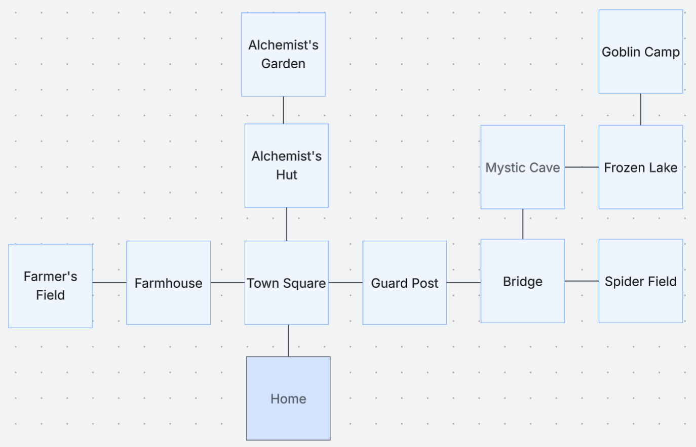
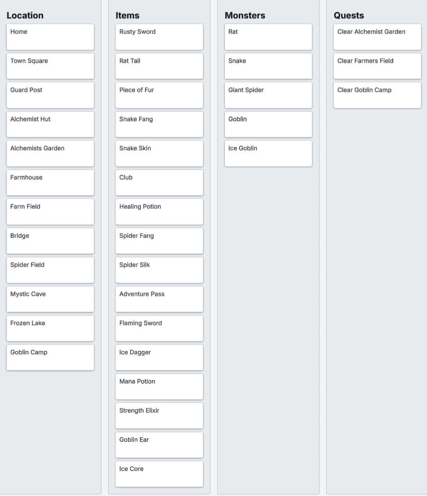
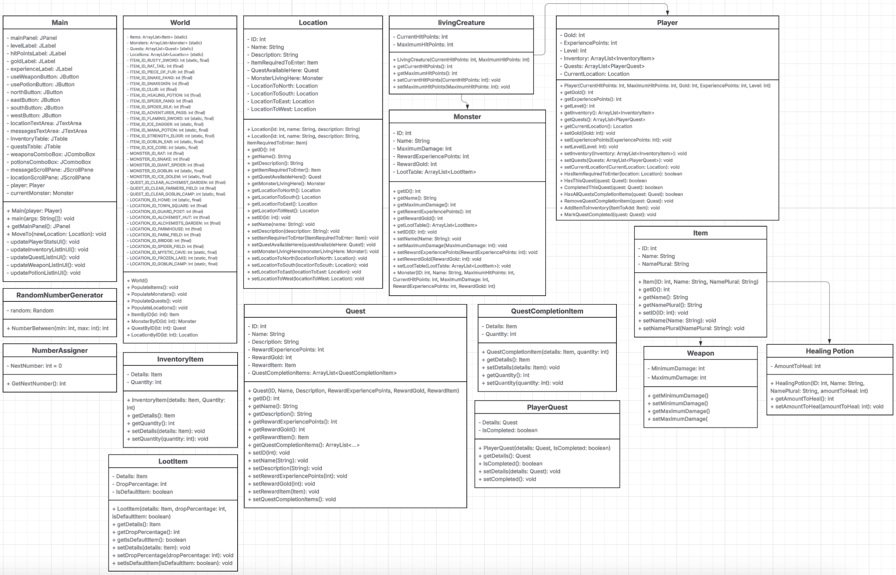
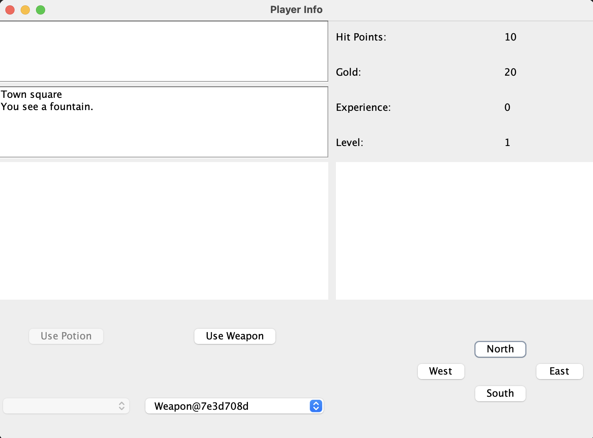
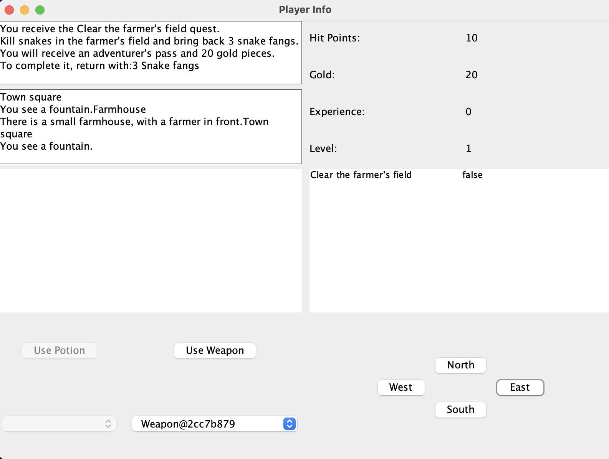

<!-- Header -->
<div align="center">
  <h2 align="center">RPG Game</h2>
  <p align="center">
    A classic RPG built in Java with a Swing GUI and object-oriented architecture.
    <br />
    <a href="https://github.com/SpencerVJones/RPGGAME/issues">Report Bug</a>
    ·
    <a href="https://github.com/SpencerVJones/RPGGAME/issues">Request Feature</a>
  </p>
</div>

<!-- PROJECT SHIELDS -->


---
### Table of Contents
- [Overview](#overview)
- [Technologies Used](#technologies-used)
- [Features](#features)
- [Project Structure](#project-structure)
- [Getting Started](#getting-started)
  - [Prerequisites](#prerequisites)
  - [Installation](#installation)
  - [How to Play](#how-to-play)
- [Usage](#usage)
- [Roadmap](#roadmap)
- [Contributing](#contributing)
	- [Contributors](#contributors)
- [License](#license)
- [Contact](#contact)
- [Visuals](#visuals)

---
 ### Overview
This is a Java-based RPG game project featuring a rich world with multiple locations, items, monsters, quests, and an interactive UI built using Swing. The game allows players to explore, battle monsters, collect items, and complete quests while navigating through various maps.

---
### Technologies Used
* [Java](https://www.java.com/)
* [Java Swing](https://docs.oracle.com/javase/8/docs/technotes/guides/swing/)
* Object-Oriented Programming

---
### Features
- **Explorable Map:** Multiple locations connected in a game world with unique challenges.
- **Inventory System:** Collect and manage weapons, potions, and other items.
- **Combat System:** Fight monsters with various stats and abilities.
- **Quest System:** Complete quests with objectives and rewards.
- **User Interface:** Intuitive Swing-based GUI with buttons, labels, and interactive elements.
- **Object-Oriented Design:** Well-structured classes including Player, Location, Monster, Item, and World.
- **UML Diagrams:** Detailed class diagrams to visualize game architecture.

---
### Project Structure

```bash
RPGGAME/
├── src/
│   ├── HealingPotion.java
│   ├── InvenetoryItem.java
│   ├── Item.java
│   ├── LivingCreature.java
│   ├── Location.java
│   ├── Main.form
│   ├── Main.java
│   ├── Monster.java
│   ├── Player.java
│   ├── PlayerQuest.java
│   ├── Quest.java
│   ├── QuestCompletionItem.java
│   ├── RandomNumberGenerator.java
│   ├── Weapon.java
│   └── World.java
├── README.md
└── LICENSE.md
```

---
### Getting Started
#### Prerequisites
- Java Development Kit (JDK) 17 or higher
- IntelliJ IDEA or any Java IDE
- Maven or Gradle (if used for build, otherwise plain Java compilation)
#### Installation
1. Clone the repository:
   ```bash
   git clone https://github.com/SpencerVJones/RPGGAME.git
2. Open the project in your Java IDE.
3. Build the project.
4. Run the Main class to start the game.
####  How to Play
- Use the directional buttons (North, South, East, West) to move between locations.
- Manage your inventory using the UI buttons.
- Engage monsters and use weapons or healing potions in battles.
- Complete quests by visiting required locations and collecting necessary items.
 
 ---
### Usage
Launch the game and interact with the GUI. 
- Navigate between locations
- Battle monsters
- Use healing potions
- Equip and switch weapons
- Gain XP and level up
Future plans include a more robust questing system and saving/loading game state.

 ---
### Roadmap
 - [ ] Add game save/load functionality
 - [ ] Introduce more complex monster AI
 - [ ] Implement boss battles
 - [ ] Expand the quest system
 - [ ] Add music and sound effects
 - [ ] Create difficulty levels
See open issues for a full list of proposed features (and known issues).

 ---
### Contributing
Contributions are welcome! Feel free to submit issues or pull requests with bug fixes, improvements, or new features.
- Fork the Project
- Create your Feature Branch (git checkout -b feature/AmazingFeature)
- Commit your Changes (git commit -m 'Add some AmazingFeature')
- Push to the Branch (git push origin feature/AmazingFeature)
- Open a Pull Request

#### Contributors
<a href="https://github.com/SpencerVJones/RPGGAME/graphs/contributors">
  
</a>

---
### License
Distributed under the MIT License. See LICENSE for more information.

---
### Contact
GitHub: [@SpencerVJones](https://github.com/SpencerVJones) <br>
Email: SpencerVJones@outlook.com <br>
Project Link: https://github.com/SpencerVJones/RPGGAME <br>

---
### Visuals
#### Map Image: Main game world map.
- [Map (Lucidspark)](https://lucid.app/lucidspark/721cc561-be0a-40c1-8cfc-d6671b249f59/edit?invitationId=inv_e4a64a06-7862-4f73-8185-28d8540dcf91&page=0_0#)


#### Location, Item, Monster, and Quest Chart: Chart outlining all locations, items, monsters, and quest.
- [Chart (Lucidspark)](https://lucid.app/lucidspark/721cc561-be0a-40c1-8cfc-d6671b249f59/edit?invitationId=inv_e4a64a06-7862-4f73-8185-28d8540dcf91&page=0_0#)


#### UML Diagrams: Overall class diagram of game architecture.
- Class relationships for Player and Item hierarchy.
- [UML Diagram (Lucidchart)](https://lucid.app/lucidchart/b0b5c01c-ae56-46f1-add1-97a99082ef4d/edit?invitationId=inv_be24f28a-13ba-428e-ad28-1644c97d59a3&page=HWEp-vi-RSFO#)


#### User Interface (UI) Screenshots: The main game window with player stats and controls.
  

